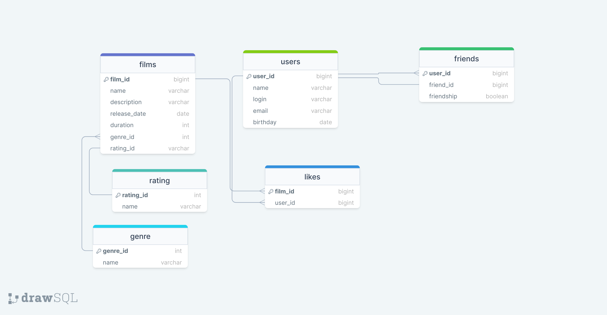

# java-filmorate
## Схема базы данных проекта

### Примеры SQL запросов к БД:
Топ 5 самых популярных фильмов
```
SELECT
films.name
FROM films
WHERE film_id IN (SELECT film_id
                   FROM likes
                   GROUP BY film_id
                   ORDER BY COUNT(user_id) DESC
                   LIMIT 5);
```
