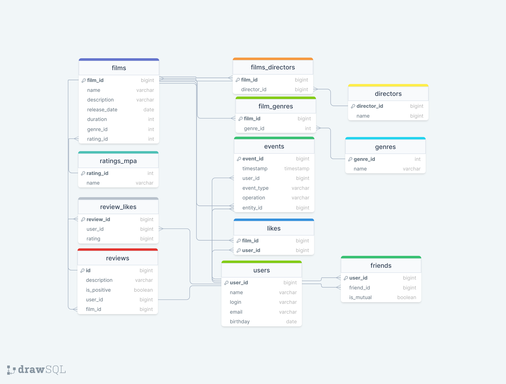

# java-filmorate
## Схема базы данных проекта

- films
Содержит данные о фильмах
- genres
Содержит данные о существующих жанрах
- film_genres 
Содержит данные о жанре конкретного фильма
- ratings_mpa
Содержит данные о существующих рейтингах МРА
- likes
Содержит данные о том, какой пользователь какой фильм лайкнул
- users
Содержит данные о пользователях
- friends
Содержит данные о взаимности дружбы

### Примеры SQL запросов к БД:
Топ 5 самых популярных фильмов
```
SELECT
films.name
FROM films
WHERE film_id IN (SELECT film_id
                   FROM likes
                   GROUP BY film_id
                   ORDER BY COUNT(user_id) DESC
                   LIMIT 5);
```
Возвращает список всех пользователей 
```
SELECT *
FROM users;
```
